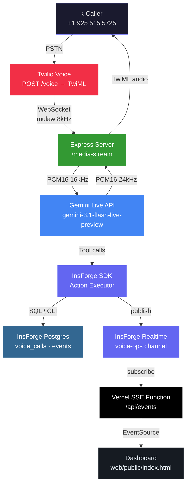
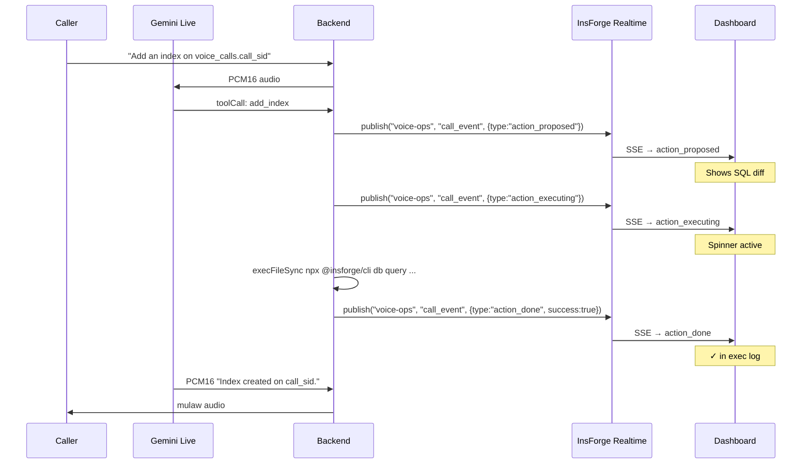

<div align="center">

# Gojo — InsForge Voice Control

**Control your cloud infrastructure with your voice.**

[](https://nodejs.org)
[](https://www.typescriptlang.org)
[](https://deepmind.google/technologies/gemini/)
[](https://www.twilio.com)
[](https://insforge.com)
[](https://tryreplicas.com)
[](https://vercel.com)
[](LICENSE)

*InsForge Hackathon — Solo build, 6 hours*

---

**Call `+1 (925) 515-5725`**  →  speak a command  →  watch your infrastructure change live.

> **On load:** Gojo splash screen — cartoon Gojo mascot (white hair, blindfold) surrounded by 5 orbiting sponsor logos. Dismisses when SSE connects.

</div>

---

## What This Does

You dial a phone number. A voice AI answers — "InsForge Control online. What do you need?" — and you talk to it like a senior engineer on-call. It executes real database queries, creates indexes, deploys edge functions, and tails logs against your live InsForge project. Every action streams to a web dashboard in real time: you see the SQL diff, the execution result, and a log of everything the agent touched.

No GUI. No terminal. Just a phone call.

---

## Architecture



---

## Audio Pipeline

The system converts audio between three different formats across the call lifetime:

```
┌─────────────────────────────────────────────────────────────────────────────────┐
│                          INBOUND (Caller → Gemini)                              │
│                                                                                 │
│  Twilio PSTN  ──►  mulaw 8kHz  ──►  decode  ──►  PCM16 16kHz  ──►  Gemini Live │
│                  base64 160B            alawmulaw     base64                    │
│                  20ms frames            (CJS shim)    audio/pcm;rate=16000      │
│                                                                                 │
├─────────────────────────────────────────────────────────────────────────────────┤
│                          OUTBOUND (Gemini → Caller)                             │
│                                                                                 │
│  Gemini Live  ──►  PCM16 24kHz  ──►  resample  ──►  mulaw 8kHz  ──►  Twilio   │
│                  base64 msg.data        16kHz↓        base64                   │
│                                                        160B frames              │
└─────────────────────────────────────────────────────────────────────────────────┘
```

**Why three formats?** Twilio uses mulaw (G.711) at 8kHz — the global PSTN standard. Gemini Live requires linear PCM at 16kHz in, and outputs PCM at 24kHz. The `audioConverter.ts` service handles both legs. `alawmulaw` is loaded via `createRequire` (CJS shim) because the rest of the codebase is ESM-only.

---

## Voice Agent

The agent runs as a Gemini Live session with strict voice persona rules:

- **Identity:** "InsForge Control" — never identifies as AI
- **Response length:** 1-2 sentences max (this is a phone call, not a chatbot)
- **Latency:** Gemini sends audio before the tool call completes — barge-in support via Twilio `clear` event
- **Tool routing:** interprets natural language to one of 5 actions automatically

### Latency Notes

- Gemini turn detection is tuned for faster handoff with `prefixPaddingMs: 20` and `silenceDurationMs: 250`.
- Early Twilio media frames are buffered while Gemini connects, so the caller's first words are less likely to be clipped.
- InsForge CLI actions now run asynchronously, and realtime dashboard publishes no longer block the voice turn loop.

### Available Tools (11 total, 6 sponsors)

| Tool | Sponsor | Trigger phrases | What it does |
|------|---------|----------------|--------------|
| `run_sql` | InsForge · Postgres | "show me...", "query...", "how many..." | Read-only SELECT on InsForge Postgres |
| `add_index` | InsForge · Postgres | "add an index", "optimize...", "it's slow" | `CREATE INDEX IF NOT EXISTS` via CLI |
| `deploy_edge_fn` | InsForge · Edge Functions | "deploy a function", "update the edge fn" | Writes TS to tmp file, deploys via CLI |
| `get_logs` | InsForge · Logs | "check logs", "any errors", "what happened" | Tails `insforge.logs` or `function.logs` |
| `check_storage` | InsForge · Storage | "show storage", "list buckets" | `npx @insforge/cli storage list` |
| `send_sms` | Twilio · SMS | "text me", "send me a summary", "SMS" | Twilio REST API sends message to caller |
| `spawn_coding_agent` | Replicas · Coding Agent | "write code", "create a migration" | Spawns Replicas agent, polls for diff, auto-notifies Slack |
| `spawn_devin_agent` | Devin · Cognition AI | "spawn a devin agent", "start an agent on the repo" | Launches Devin session on `gojo-mock-api`, streams status, opens PR |
| `send_agent_message` | Devin · Cognition AI | "tell agent 2...", "refocus the agent" | Routes follow-up instruction to running Devin session |
| `analyze_with_ai` | Gemini · AI Gateway | "analyze this", "any anomalies", "summarize" | Gemini text API analyzes data and returns recommendations |
| `send_slack` | Slack · Webhooks | "notify slack", "ping the team", "post to slack" | Incoming Webhook POST; also auto-triggered after coding agents complete |

### Slack Integration (`send_slack` + `/gojo` slash command)

Gojo sends outgoing notifications to Slack via Incoming Webhooks, and accepts inbound commands via a Slack slash command:

```
POST /slack/command  ← Slack /gojo slash command target
```

Supported `/gojo` commands in Slack:
```
/gojo sql SELECT * FROM voice_calls LIMIT 5
/gojo logs
/gojo storage
/gojo analyze <question>
/gojo code <task description>
/gojo sms +14155551234 <message>
```

**Setup:** In Slack App settings → Incoming Webhooks → add `SLACK_WEBHOOK_URL` to the repo-root `.env`. For the slash command, create a `/gojo` slash command pointing to `POST https://your-ngrok-url/slack/command`, and set `SLACK_SIGNING_SECRET` so the backend can verify Slack signatures before executing commands.

Replicas coding agent results are **automatically pushed to Slack** as rich Block Kit messages with diff previews.

### Multi-Agent Parallel View

Calling "spawn a Devin agent" or "run 2 agents" spawns Devin sessions in parallel on the [`gojo-mock-api`](https://github.com/Dhruva966/gojo-mock-api) repo. The dashboard shows a **split-screen agent grid** that auto-adjusts:

- 1 agent → full-width card
- 2 agents → side by side
- 3–4 agents → 2×2 grid

Each card shows: task description, live Devin session link, AI-narrated summary, and diff on completion.

**Sonnet Router:** As you speak, every voice transcript is asynchronously analyzed by Gemini Flash. If you address a specific agent's domain ("work on the auth middleware"), a routing decision is broadcast to the dashboard and shown in real time. This never blocks the voice pipeline — it runs via `void` promise.

### Mock Repo Target

[`Dhruva966/gojo-mock-api`](https://github.com/Dhruva966/gojo-mock-api) — a minimal Express + TypeScript REST API with users, posts, auth, and Postgres. Devin agents work on this repo during demos.

### Security Model

```
run_sql       → SELECT-only guard + semicolon injection block
add_index     → table/column validated against /^[a-zA-Z0-9_]+$/
deploy_edge_fn → slug validated against /^[a-zA-Z0-9_-]+$/ + tmp file cleanup
get_logs      → source validated against allowlist Set{"insforge.logs","function.logs"}
Twilio voice  → signature required unless DISABLE_TWILIO_SIGNATURE_VALIDATION=true in non-production
Slack command → HMAC signature + timestamp verified before tool execution
all CLI calls → execFileSync (not execSync) — no shell injection surface
```

---

## Realtime Event Flow

The runtime emits structured events to the InsForge Realtime `voice-ops` channel. The Vercel SSE function subscribes and forwards live telemetry to the browser as `text/event-stream`. Call session rows are persisted in `voice_calls`; the `events` table exists for replay/audit work but is not yet populated for every streamed event.



### Event Schema

```typescript
type CallEvent =
  | { type: "call_started";         callSid: string; callerPhone: string; timestamp: string }
  | { type: "transcript";           callSid: string; role: "agent" | "user"; text: string; timestamp: string }
  | { type: "action_proposed";      callSid: string; action: string; params: object; diff: string; sponsor?: string }
  | { type: "action_executing";     callSid: string; action: string; sponsor?: string }
  | { type: "action_done";          callSid: string; action: string; result: string; success: boolean; durationMs: number; sponsor?: string; diff?: string }
  | { type: "call_ended";           callSid: string; actionCount: number; duration: number }
  | { type: "sms_sent";             callSid: string; to: string; messageSid: string }
  | { type: "coding_agent_started"; callSid: string; agentId: string; task: string }
  | { type: "coding_agent_done";    callSid: string; agentId: string; diff: string; filesChanged: string[] }
  | { type: "ai_analysis_done";     callSid: string; question: string; analysis: string }
```

---

## Dashboard

```
┌─────────────────────────────────────────────────────────────────────────┐
│ ●  InsForge Voice Control                         Call active           │
├─────────────┬───────────────────────────────────────────────────────────┤
│ CALL STATUS │                                                           │
│  Active     │   -- SQL Query                                            │
│  CA4f8...   │   SELECT * FROM voice_calls                               │
│             │   ORDER BY started_at DESC                                │
│ ACTIVE OP   │   LIMIT 5                                                 │
│ ▶ run_sql   │                                                           │
│             │   -- Result: 5 row(s)                                     │
│ EXEC LOG    │                                                           │
│ ✓ run_sql   │                                                           │
│ ✓ add_index │                                                           │
├─────────────┴───────────────────────────────────────────────────────────┤
│ [agent] Index created on call_sid. Want me to check something else?     │
└─────────────────────────────────────────────────────────────────────────┘
```

Deployed at Vercel. `web/api/events.ts` is a serverless SSE function (`maxDuration: 300`) that subscribes to InsForge Realtime and streams events to the browser. Auto-reconnects on drop.

---

## Tech Stack

| Layer | Technology | Why |
|-------|-----------|-----|
| Voice inbound | Twilio Voice + Media Streams | PSTN connectivity, WebSocket audio bridge |
| Voice AI | Gemini 3.1 Flash Live (`@google/genai` v2.3) | Sub-second latency, native function calling, audio transcription |
| Audio codec | `alawmulaw` (CJS shim via `createRequire`) | mulaw↔PCM16 conversion — no native deps |
| HTTP + WS server | Express 4 + `ws` | Lightweight; WS and HTTP on same port |
| Database | InsForge Postgres | Live infra target — schema is the demo |
| Realtime bus | InsForge Realtime (`voice-ops` channel) | Push events to dashboard without polling |
| Dashboard | Vanilla HTML + EventSource | Zero build step, CDN highlight.js for diffs |
| SSE function | Vercel Serverless (`nodejs22.x`) | 300s max duration for persistent SSE |
| Validation | Zod | Env var parsing with type safety |
| Runtime | `tsx` + ESM (`"type":"module"`) | ESM-native required by `@insforge/sdk` |

---

## Database Schema

```sql
-- One row per Twilio call
CREATE TABLE voice_calls (
  id           UUID PRIMARY KEY DEFAULT gen_random_uuid(),
  call_sid     TEXT UNIQUE NOT NULL,          -- Twilio CallSid
  caller_phone TEXT,                          -- E.164 format
  started_at   TIMESTAMPTZ DEFAULT now(),
  ended_at     TIMESTAMPTZ,
  duration_s   INT,
  action_count INT DEFAULT 0,
  status       TEXT DEFAULT 'active'
               CHECK (status IN ('active', 'completed', 'error'))
);

-- Reserved for replay / audit work alongside live realtime streaming
CREATE TABLE events (
  id         UUID PRIMARY KEY DEFAULT gen_random_uuid(),
  call_id    UUID REFERENCES voice_calls(id) ON DELETE CASCADE,
  call_sid   TEXT NOT NULL,
  type       TEXT NOT NULL,
  payload    JSONB NOT NULL,
  created_at TIMESTAMPTZ DEFAULT now()
);
```

RLS enabled on both tables. Admin key (`ik_03…`) bypasses RLS for backend writes.

---

## Directory Structure

```
insforge-voice-control/
├── api/                        ← Voice agent backend (Node.js + Express + WS)
│   ├── src/
│   │   ├── server.ts           ← HTTP + WebSocket server entry
│   │   ├── config.ts           ← Zod env validation
│   │   ├── routes/
│   │   │   ├── voice.ts        ← POST /voice → TwiML <Connect><Stream>
│   │   │   └── mediaStream.ts  ← WS /media-stream handler
│   │   ├── middleware/
│   │   │   └── twilioValidate.ts
│   │   ├── services/
│   │   │   ├── gemini/
│   │   │   │   ├── liveSession.ts    ← Gemini Live connect + tool dispatch
│   │   │   │   ├── audioConverter.ts ← mulaw ↔ PCM16 codec
│   │   │   │   ├── tools.ts          ← FunctionDeclaration[] for Gemini
│   │   │   │   └── systemPrompt.ts   ← Agent persona + routing rules
│   │   │   └── insforge/
│   │   │       ├── client.ts         ← createAdminClient singleton
│   │   │       ├── sessions.ts       ← createSession / completeSession
│   │   │       ├── realtime.ts       ← connect → subscribe → publish
│   │   │       └── actions.ts        ← 5 tool implementations + security
│   │   └── utils/
│   │       ├── phone.ts
│   │       └── twiml.ts
│   ├── package.json            ← "type":"module" required for ESM
│   └── tsconfig.json           ← module:ESNext + moduleResolution:Bundler
├── web/                        ← Dashboard (Vercel static + SSE function)
│   ├── public/
│   │   └── index.html          ← Single-file SPA, 4 panels, CDN deps only
│   ├── api/
│   │   └── events.ts           ← Vercel SSE function, InsForge Realtime relay
│   ├── package.json
│   └── vercel.json             ← outputDir:public, maxDuration:300
├── db/
│   └── migrations/
│       └── 001_init.sql        ← voice_calls + events schema
├── docs/
│   └── RESEARCH.md             ← Verified API docs, CLI syntax, code patterns
└── .env                        ← Never committed
```

---

## Quick Start

### Prerequisites

- Node.js 22+
- [ngrok](https://ngrok.com) account (free tier works)
- Twilio account with a phone number
- InsForge project (free tier)
- Google AI Studio API key

### 1. Clone and install

```bash
git clone https://github.com/Dhruva966/insforge-voice-control
cd insforge-voice-control
cd api
npm install
```

### 2. Configure environment

```bash
touch .env  # runtime reads the repo-root .env
```

```env
GEMINI_API_KEY=your_key
GEMINI_MODEL=gemini-3.1-flash-live-preview
GEMINI_VOICE=Puck

TWILIO_ACCOUNT_SID=ACxxxxxxxxxxxxxxxxxxxxxxxxxxxxxxxx
TWILIO_AUTH_TOKEN=your_auth_token
TWILIO_PHONE_NUMBER=+1xxxxxxxxxx
TWILIO_WEBHOOK_BASE=https://YOUR-NGROK.ngrok-free.app

INSFORGE_URL=https://YOUR-PROJECT.us-east.insforge.app
INSFORGE_KEY=ik_xxxxxxxxxxxxxxxxxxxxxxxxxxxxxxxx

SLACK_SIGNING_SECRET=optional_for_/slack/command
SLACK_WEBHOOK_URL=optional_for_send_slack
DISABLE_TWILIO_SIGNATURE_VALIDATION=false

PORT=3000
NODE_ENV=development
```

### 3. Apply database schema

```bash
# The InsForge CLI resolves migrations/ relative to the current working directory.
# Run migration commands from /db so 001_init.sql is discovered.
npx @insforge/cli link --api-base-url $INSFORGE_URL --api-key $INSFORGE_KEY
cd db
npx @insforge/cli db migrations up --all
cd ..
```

### 4. Start the API server

```bash
cd api && npm run dev
# [server] listening on :3000
```

### 5. Expose via ngrok

```bash
ngrok http 3000
# Copy the https URL → set TWILIO_WEBHOOK_BASE in .env
```

### 6. Configure Twilio webhook

Twilio Console → Phone Numbers → your number → Voice Configuration:
- **Webhook URL:** `https://YOUR-NGROK.ngrok-free.app/voice`
- **HTTP Method:** POST

### 7. Open dashboard

```bash
open web/public/index.html
# Or deploy to Vercel (see below)
```

### 8. Call the number

Dial your Twilio number. You'll hear:

> *"InsForge Control online. What do you need?"*

---

## Vercel Deploy (Dashboard)

```bash
cd web/
npm install
vercel login
vercel link
vercel env add INSFORGE_URL production
vercel env add INSFORGE_KEY production
vercel --prod
```

The `vercel.json` is pre-configured: static files from `public/`, SSE function at `api/events.ts` with 300-second max duration.

---

## Demo Script (8 steps, all 5 sponsors)

| # | You say | Sponsor hit | Dashboard shows |
|---|---------|-------------|----------------|
| 1 | *(dials +1 925 515 5725)* | **Twilio** · Voice + Media Streams | Status dot pulses green; Twilio hands off bidirectional mulaw WebSocket to server |
| 2 | Agent answers | **Gemini** · Live API | "InsForge Control online — Postgres, Edge Functions, Realtime, and AI all standing by." — real-time transcript bubble |
| 3 | "Show me the last five calls" | **InsForge** · Postgres | SQL diff: `SELECT … FROM voice_calls ORDER BY started_at DESC LIMIT 5` → result rows |
| 4 | "Add an index on voice_calls, column call_sid" | **InsForge** · Postgres | `CREATE INDEX IF NOT EXISTS idx_voice_calls_call_sid` diff → ✓ in exec log |
| 5 | "Deploy an analytics edge function" | **InsForge** · Edge Functions | TypeScript function code diff → "deployed" badge |
| 6 | "Analyze these results for anomalies" | **Gemini** · AI Gateway | Gemini text analysis of query results — p99 latency, anomalies, recommendations |
| 7 | "Text me a summary" | **Twilio** · SMS | Twilio SMS diff (TO/FROM/SID/body) → SMS delivered to caller's phone |
| 8 | "Write a migration for archiving old calls" | **Replicas** · Coding Agent | TypeScript migration diff generated by Replicas coding agent |
| — | "No, that's all" | **Vercel** · SSE | "InsForge Control out." — call row finalized, live SSE maintained for 300s |

> **No call needed for demos** — use the interactive panel on the dashboard right sidebar to trigger any step independently.

---

## Sponsor Coverage

### InsForge — Maximum Platform Depth

InsForge is not just a database — this project exercises every major feature:

| InsForge Feature | How it's used |
|-----------------|--------------|
| **Postgres** | `run_sql` — voice-triggered SELECT queries on live schema |
| **Postgres** | `add_index` — `CREATE INDEX IF NOT EXISTS` via `@insforge/cli db query` |
| **Edge Functions** | `deploy_edge_fn` — Gemini writes TS code, CLI deploys it live |
| **Storage** | `check_storage` — lists buckets; voice-accessible storage audit |
| **Realtime** | `broadcastEvent()` — every action emits structured events to `voice-ops` channel |
| **Realtime** | SSE relay in `web/api/events.ts` subscribes and streams to browser via `EventSource` |
| **Admin SDK** | `createAdminClient()` with RLS bypass for backend writes |
| **CLI** | `npx @insforge/cli` for all infra mutations — no direct Postgres connection |

### Twilio — Beyond Basic Voice

| Twilio Feature | How it's used |
|---------------|--------------|
| **Voice Inbound** | PSTN number +1 (925) 515-5725 with TwiML `<Connect><Stream>` |
| **Media Streams** | Bidirectional WebSocket — mulaw 8kHz audio in real time |
| **Signature Validation** | `twilioValidate.ts` middleware verifies every POST/voice webhook |
| **SMS** | `send_sms` tool — Twilio REST API sends post-action summaries to the caller |

### Google Gemini — Two Distinct API Surfaces

| Gemini Feature | How it's used |
|---------------|--------------|
| **Live API** (`gemini-3.1-flash-live-preview`) | Bidirectional audio streaming, sub-second latency, native function calling |
| **Text API** (`gemini-2.0-flash`) | `analyze_with_ai` — synchronous analysis of query results, log anomalies, and optimization recommendations |
| **Transcription** | `inputTranscription` + `outputTranscription` configs for real-time transcript bubbles |
| **Tool routing** | 8 `FunctionDeclaration`s — Gemini selects the right tool from natural language intent |

### Vercel — Persistent SSE Infrastructure

| Vercel Feature | How it's used |
|---------------|--------------|
| **Static Hosting** | `web/public/index.html` — zero-build SPA with CDN-only dependencies |
| **Serverless Function** | `web/api/events.ts` — SSE relay with `maxDuration: 300` (not available on default 10s limit) |
| **Node.js 22 runtime** | Latest LTS runtime for ESM-native serverless execution |

### Replicas — AI Coding Agent on Demand

| Replicas Feature | How it's used |
|----------------|--------------|
| **Coding Agent** | `spawn_coding_agent` — voice triggers a Replicas agent to generate TypeScript migrations, edge functions, and fix suggestions |
| **Poll API** | Backend polls `/v1/replicas/{id}` until `status === "completed"`, then streams diff to dashboard |

---

## Reference

Architecture adapted from: [gandhiaayush/dry-cleaning-voice-agent](https://github.com/gandhiaayush/dry-cleaning-voice-agent)
